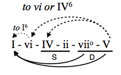

# Allolib State Machine Thing
This weird compiler-like program will generate a complex set of allolib instructions from a simple graph!

## Motivation
State machines seem to represent many music-theoretical constructs quite naturally. For example, functional harmony relies on the fact that some transitions between chords are more pleasing than others. We can encode these transitions into a formal, graph-like structure and then generate music by "hopping" between chords. If a node has multiple outgoing edges (i.e., many possible chords can follow from a given one), one will automatically be chosen randomly.

## Usage
1. Write your graph down first. It could be composed of many things, like chords that move between each other or notes that move stepwise. 
   For example:
   
   
2. Encode the graph into python syntax (there's an example on its way, see `./generator/parser.py` in the meantime)

3. Print the output and plug into allolib!

## Files
`idea.md` - My initial stream-of-consciousness
`generator/` - Contains the behind-the-scenes stuff (graph aggregation and codegen)
